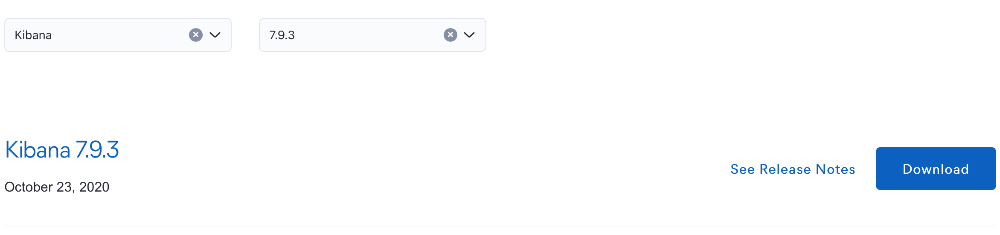

---
meta:
  - name: description
    content: es教程 安装Kibana和Cerebro客户端
  - name: keywords
    content: es教程,es客户端,es连接工具,kibana安装,cerebro安装
---
# 1.3 ElasticSearch客户端

ElasticSearch目前比较流行的可视化客户端

- Head插件
- Kibana
- Cerebro

本书演示Kibana和Cerebro安装，任选其一学习即可  

<font color="red">**我个人比较喜欢用Cerebro，所以在本书大部分可视化场景操作都是用这个**</font>

对于Head插件，这个东西我个人感觉不太好用，所以本文不讲述  

**当然，有兴趣分享的同学可以提Lssues，我来做更新**

## 1.3.1. Kibana

### 1. 下载kibana
Cerebro是ES官网提供的一个开源的分析与可视化平台，设计出来用于和Elasticsearch一起使用的。

> Kibana下载地址：[点击打开](https://www.elastic.co/cn/downloads/past-releases#kibana)
>
> 检索7.9.3版本，本书用7.9.3版本讲解



选择对应自己需要的操作系统版本，下载后解压。

### 2. 配置Kibana

Kibana的配置文件位于config/kibana.yml中。您需要打开该文件并进行以下配置：

- server.port：设置Kibana使用的端口。默认端口是5601。
- elasticsearch.hosts：设置Elasticsearch的地址。默认地址是[http://localhost:9200](http://localhost:9200)。

```shell
server.port: 5601
elasticsearch.hosts: ["http://localhost:9200"]
```
>可以新增配置，也可以把文件对应的配置注释删掉

### 3. 启动Kibana

- Linux下进入目录，输入以下运行命令

  ```shell
  bin/kibana
  ```

- Windows下直接双击kibana.bat文件启动

启动较慢，需要有耐心等几分钟

一旦Kibana启动，您可以在Web浏览器中访问它。默认情况下，Kibana运行在5601端口，所以您可以在浏览器中输入[http://localhost:5601](http://localhost:5601)访问它


## 1.3.2. Cerebro

### 1. 下载Cerebro
Cerebro是一款非常好用的用来监控ES集群的项目。通过此插件我们可以查看ES集群的详细状况、索引的创建、配置等工作。

> Cerebro下载地址：[点击打开](https://github.com/lmenezes/cerebro/releases)
>
> 我用v0.8.5版本
### 2. 解压Cerebro
不用多讲
### 3. 启动Cerebro
```shell
bin/cerebro
```
默认启动端口是9000，浏览器中输入[http://localhost:9000](http://localhost:9000)访问它


**Node address输入 `http://localhost:9200` 点击Connect连接**

