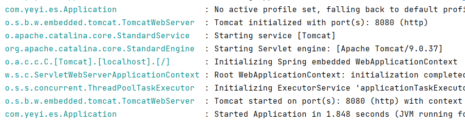

# 1.4 程序连接ElasticSearch


## 1.4.1 SpringBoot集成ElasticSearch

SpringBoot是目前Java开发主流的开源框架，很多项目都是基于SpringBoot开发，在本书中，我们使用SpringBoot演示操作ES。

### 1. 创建项目
创建SpringBoot项目，导入Maven依赖
导入es依赖需要的依赖、fastjson依赖，fastjson后续会用
```xml
<dependency>
    <groupId>org.elasticsearch</groupId>
    <artifactId>elasticsearch</artifactId>
    <version>7.9.3</version>
</dependency>
<dependency>
    <groupId>org.elasticsearch.client</groupId>
    <artifactId>elasticsearch-rest-high-level-client</artifactId>
    <version>7.9.3</version>
</dependency>
<dependency>
    <groupId>com.alibaba</groupId>
    <artifactId>fastjson</artifactId>
    <version>1.2.78</version>
</dependency>
```
### 2. 编写配置
1. 新建配置类 `ElasticSearchConfig` 写入以下代码
```java
import org.apache.http.HttpHost;
import org.elasticsearch.client.RestClient;
import org.elasticsearch.client.RestClientBuilder;
import org.elasticsearch.client.RestHighLevelClient;
import org.springframework.context.annotation.Bean;
import org.springframework.context.annotation.Configuration;


@Configuration
public class ElasticSearchConfig {

    @Bean
    public RestHighLevelClient esRestClient(){
        // ES连接地址，集群写多个
        RestClientBuilder builder = RestClient.builder(
                new HttpHost("localhost", 9200, "http"));
        RestHighLevelClient client = new RestHighLevelClient(builder);
        return client;
    }
}
```
创建ES客户端对象 `RestHighLevelClient` 添加配置信息，注入到Spring容器中

2. 新建控制层类 `EsController` 增加创建索引接口
```java
package com.yeyi.es.controller;

import org.elasticsearch.client.RequestOptions;
import org.elasticsearch.client.RestHighLevelClient;
import org.elasticsearch.client.indices.CreateIndexRequest;
import org.elasticsearch.common.xcontent.XContentType;
import org.springframework.beans.factory.annotation.Autowired;
import org.springframework.web.bind.annotation.RequestMapping;
import org.springframework.web.bind.annotation.RestController;

import java.io.IOException;

@RestController
public class EsController {

    @Autowired
    private RestHighLevelClient client;

    @RequestMapping("/createIndex")
    public Boolean createIndex(String indexName) {
        CreateIndexRequest request = new CreateIndexRequest(indexName);
        request.mapping(
                "{\n" +
                        "  \"properties\": {\n" +
                        "    \"message\": {\n" +
                        "      \"type\": \"text\"\n" +
                        "    }\n" +
                        "  }\n" +
                        "}",
                XContentType.JSON);
        try {
            client.indices().create(request, RequestOptions.DEFAULT);
            return true;
        } catch (IOException e) {
            e.printStackTrace();
        }
        return false;
    }
}
```
此段代码定义一个接口，根据请求参数值，创建对应名称的索引

示例目录如下：


### 3. 启动项目测试
1. 启动项目，查看日志如下所示为运行成功



2. 打开接口地址，并传递索引名称参数创建索引

[http://localhost:8080/createIndex?indexName=test_index](http://localhost:8080/createIndex?indexName=test_index)

SpringBoot默认端口是8080，请根据项目实际端口进行改动

3. 验证创建结果

打开Cerebro [http://localhost:9000](http://localhost:9000)


我们会发现多了一个索引，说明我们操作成功了

## 1.4.2 其他程序连接方式待补充