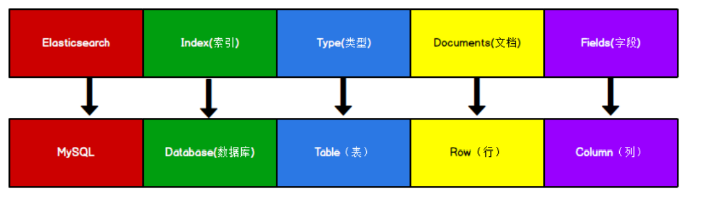

# 1.1 初识ElasticSearch

## 1.1.1 ElasticSearch 简介

Elasticsearch是一个开源的、基于Apache Lucene库的搜索引擎，它提供了全文搜索能力，特别适合于处理大量文本数据。下面是对Elasticsearch的一些主要特点和功能的概述：

1. 分布式搜索： Elasticsearch是分布式的，可以在多个节点上分散和复制数据，提供了高可用性和容错性。
2. 全文搜索： Elasticsearch使用Apache Lucene库进行全文搜索，可以理解自然语言，对文本进行高亮显示，并支持多种语言。
3. 实时搜索和分析： Elasticsearch可以实时地搜索和分析数据。当新增数据时，可以立即被搜索到并进行分析。
4. 简单的API： Elasticsearch的RESTful API易于使用，可以方便地进行数据的索引、查询和分析。
5. 可扩展性： Elasticsearch可以方便地扩展其功能和性能，可以通过插件机制来添加新功能。
6. 多租户能力： Elasticsearch可以支持多租户环境，每个租户可以有自己的索引和设置。
7. 支持多种数据源： Elasticsearch可以接收来自多种数据源的数据，包括关系型数据库、NoSQL数据库、日志文件等。
8. 安全性和访问控制： Elasticsearch提供了安全性和访问控制机制，可以设置用户和角色的权限。
9. 监控和管理工具： Elasticsearch提供了丰富的监控和管理工具，方便用户管理和优化其集群的性能。
10. 总的来说，Elasticsearch是一个强大、灵活、易于使用的搜索引擎，适用于各种需要全文搜索、实时数据分析和数据管道的应用场景。

## 1.1.2 ElasticSearch 基本概念

以下是ElasticSearch的一些基本概念：

1. 索引（Index）：ElasticSearch中的索引类似于传统数据库中的数据库。它是一个包含一组相关文档的逻辑命名空间。索引用于组织和存储文档，并提供快速的数据访问。
2. 类型（Type）：索引可以包含多个类型，每个类型定义了一组具有相似结构的文档。类型类似于数据库中的表。**在Elasticsearch 7.x中，Type的概念已经被删除了**，就是一个索引下面只能有一种类型`_doc`。
3. 文档（Document）：文档是ElasticSearch中的最小数据单元。它是一个以JSON格式表示的数据对象。文档被存储在索引中，并且可以使用唯一的ID进行检索。
4. 字段（Field）：文档中的数据通过字段来表示。每个字段都有一个名称和一个对应的值。字段可以是不同类型的，例如字符串、整数、日期等。
5. 映射（Mapping）：映射定义了索引中文档的字段类型和属性。它类似于数据库表的模式定义。映射可以自动创建，也可以手动定义。
6. 分片和副本（Sharding and Replication）：为了实现高性能和高可用性，ElasticSearch将索引分成多个分片进行存储和处理。每个分片可以在集群中的不同节点上进行复制，以提供数据冗余和故障恢复能力。
7. 查询（Query）：ElasticSearch提供了丰富的查询API，用于在索引中搜索文档。查询可以根据各种条件过滤和排序文档，并返回与查询条件匹配的结果。
8. 聚合（Aggregation）：聚合是一种数据分析功能，用于从大量数据中提取有意义的信息。它可以执行各种统计、分组和计算操作，以生成汇总结果。

## 1.1.3 ElasticSearch 和关系型数据库的对比

Elasticsearch是面向文档型数据库，一条数据就是一个文档。下面是Elasticsearch存储文档数据和MySQL存储数据的一个比较。

1. 数据存储格式

ES中的Index可以看成一个库，Types相当于表，Documents相当于表的行。**在Elasticsearch 7.x中，Type的概念已经被删除了，就是一个索引下面只能有一种类型。**
2. 数据查询：
   - ElasticSearch使用DSL语句查询，提供强大的全文搜索和分析功能。它支持复杂的文本查询、模糊匹配、聚合和分析等。
   - MySQL使用SQL查询语言，支持传统的关系型数据库查询操作，例如SELECT、JOIN、GROUP BY等。
3. 数据扩展性：
   - ElasticSearch是一个分布式数据库，可以将数据分片存储在多个节点上，以提供高性能和可扩展性。它可以处理大规模数据集和高并发请求。
   - MySQL可以通过主从复制和分区等方式实现一定程度的扩展性，但在处理大规模数据和高并发负载时，性能可能受限。
4. 数据一致性：
   - ElasticSearch在写入数据时，采用近实时（near real-time）的方式，数据会先写入内存缓冲区，然后根据配置的刷新时间刷新到磁盘。因此，在写入后的一小段时间内，数据可能不会立即可见。
   - MySQL保证数据的一致性，写入操作会立即持久化到磁盘，并且读取操作可以立即获取最新数据。
5. 数据处理能力：
   - ElasticSearch在大规模数据的搜索和分析方面表现出色，特别适用于全文搜索、日志分析、实时监控等场景。
   - MySQL在传统的事务处理和关系型数据操作方面表现出色，适用于事务处理、数据关联和复杂查询等场景。

总体来说，ES在海量数据检索上有很大的性能优势，处理事务性业务不行。需要的配置（金钱）会比较昂贵。