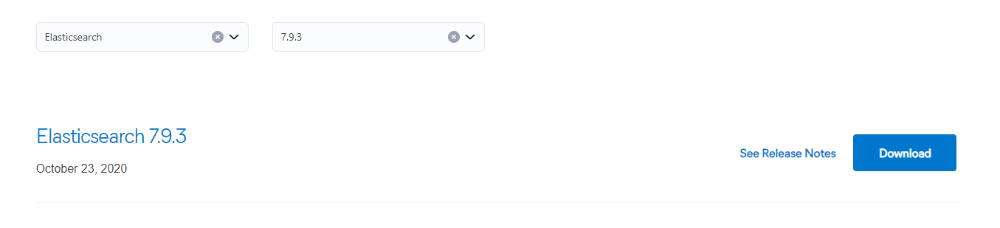
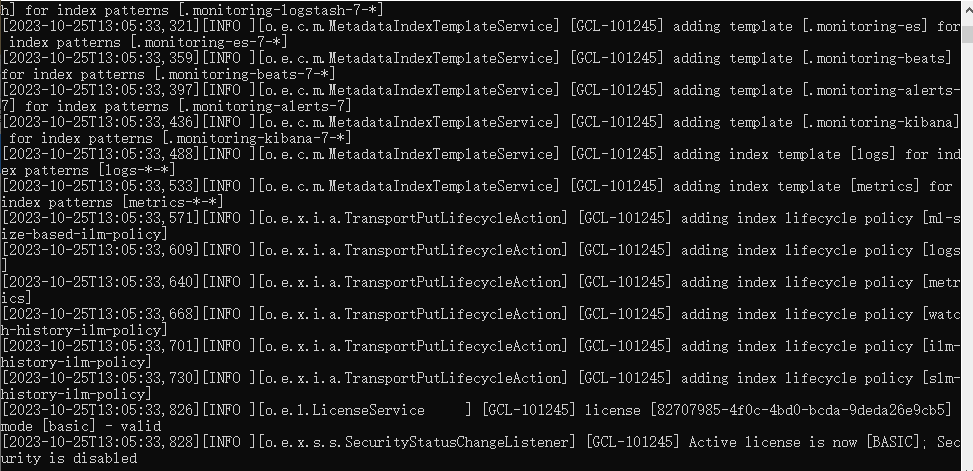

---
meta:
  - name: description
    content: ES linux环境安装es，windows环境安装es，docker环境安装es教程
  - name: keywords
    content: es安装,elasticsearch安装,linux安装es,windows安装es,docker安装es
---
# 1.2 搭建ElasticSearch环境

> ElasticSearch下载地址：[点击打开](https://www.elastic.co/cn/downloads/past-releases#elasticsearch)
>
> 检索7.9.3版本，本书用7.9.3版本讲解，注意版本不要差距过大，否则导致会出现很多小问题



**ElasticSearch是基于Java语言开发的，所以需要先配置Java的JDK环境，我用的环境是JDK1.8**


## 1.2.1 Linux环境下安装ElasticSearch

### 1. 先新建一个用户（出于安全考虑，Elasticsearch默认不允许以root账号运行。）

```shell
创建用户：
useradd esuser
设置密码：
passwd esuser
```

### 2. 下载ES安装包并解压到es目录

修改ES配置文件设置JVM堆大小 **此处为演示，要根据实际情况来，一般情况下，堆大小=机器内存/2**

config/jvm.options

```java
-Xms1g
-Xmx1g
```

### 3. 配置limits.conf文件 

修改系统 /etc/security/limits.conf文件 

```shell
vi /etc/security/limits.conf 
```

增加配置

```shell
* soft nofile 65536
* hard nofile 65536
```

**注意*不要手贱去掉**

### 4. 修改系统/etc/sysctl.conf文件

```shell
vi /etc/sysctl.conf
最后添加一行
vm.max_map_count=655360
sysctl -p
```

### 5. 启动ES

1. 将ES文件夹下的所有目录的所有权限迭代给esuser用户

```shell
chgrp -R esuser ./es
chown -R esuser ./es
chmod 777 es
```

2. 先切换到esuser用户启动

1）切换esuser用户

```shell
su esuser
```

2）通过 -d 参数，表示后台运行

```shell
./bin/elasticsearch -d
```

到这里就已经结束了，可以通过 logs/elasticsearch.log 日志，查看启动是否成功。

## 1.2.2 Windows环境下安装ElasticSearch

### 1. 下载Windows版本

### 2. 下载安装包后解压文件

### 3. 启动ES

进入 bin 目录下，双击执行 elasticsearch.bat 文件。执行文件后，可以在窗口中看到 Elasticsearch 的启动过程。

在 Elasticsearch 启动后，可以在浏览器的地址栏输入：[http://localhost:9200/](http://localhost:9200/) 查看启动情况


## 1.2.3 Docker环境下安装ElasticSearch

### 1. 拉取对应的ES版本镜像

```shell
docker pull elasticsearch:7.9.3
```



### 2. 查看镜像是否拉取成功

```shell
docker images
```


### 3. 创建数据卷挂载目录

```shell
mkdir -p /user/es/config
mkdir -p /user/es/data
mkdir -p /user/es/logs
mkdir -p /user/es/plugins
```

### 4. 启动ES

```shell
docker run --name=es -p 9200:9200 -p 9300:9300 -e "discovery.type=single-node" -v /user/es/config:/usr/share/elasticsearch/config -v /user/es/data:/usr/share/elasticsearch/data -v /user/es/logs:/usr/share/elasticsearch/logs -v /user/es/plugins:/usr/share/elasticsearch/plugins -d elasticsearch:7.9.3
```

Docker所用启动参数说明：

> –-name 容器命名  
> -p 端口映射  
> -e 环境变量，单机  
> -v 数据卷挂载，映射配置文件，数据，日志，插件  
> -d 后台运行  

### 5. 查看运行状态

```shell
docker ps
```

