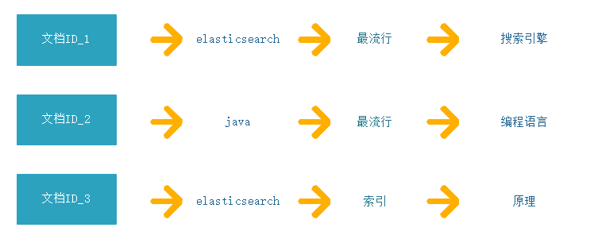
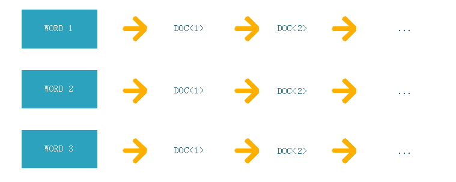

# 2.4 字段类型介绍

学习了文档操作后，基本已经入门ES了，我们会见到书中举例的一些数据类型，到本章节我们详细介绍ES中的基本数据类型和复杂的数据类型。不过在此之前要先带大家了解下`倒排索引`。

## 2.4.1 什么是倒排索引

ES采用的是倒排索引（Inverted Index）存储数据, 也称为反向索引。 有反向索引，也会有正向索引。

俗话说的好,**生平不识倒排索引,学懂ES也枉然**。这是ES的核(面)心(试)点(题)。

### 1. 正向索引
正排索引是以文档的ID作为关键字，并且记录文档中每个字段的值信息，通过查询id来把整条文档拿出来。

但是在查询某一个keyword存在于哪些文档的时候， 需要对所有文档进行扫描匹配。这样检索效率比较低下。

### 2. 倒排索引
倒排索引以字或词作为关键字索引，去找对应ID， 倒排索引建立的是分词（Term）和文档（Document）之间的映射关系。

对于0基础的同学如果还不懂，可以先用Map的结构理解，后续我们会更详细讲解。
> 把关键词作为Key，对应数据的ID作为value的list集合，通过关键词查询一组对应的ID数据

举个例子：
> 数据集：[{"id":1, "name": java},{"id":2, "name": java},{"id":3, "name": golang}]  
> map定义：(java)=[1,2]，(golang)=[3]  
> 查询过程就是拿关键词java查询ID，获取ID为1、2，然后将整条数据返回给我们

**具体实现过程肯定不是这样，但是为了新手容易理解，先对倒排索引有初步概念，后续会详细讲解倒排索引**

## 2.4.2 基础数据类型介绍

### 1. keyword类型
`keyword`类型是`不进行分词`的字符串类型，可以理解数据库的字符串类型，`不进行分词`含义指的是：不会对keyword字段内容进行分词，直接构建`倒排索引`，keyword类型应用场景比较多，一般用于对文档的过滤、排序和聚合等。

### 2. text类型

### 3. 数值类型

### 4. 布尔类型

### 5. 日期类型

## 2.4.3 复杂数据类型

## 2.4.4 建模