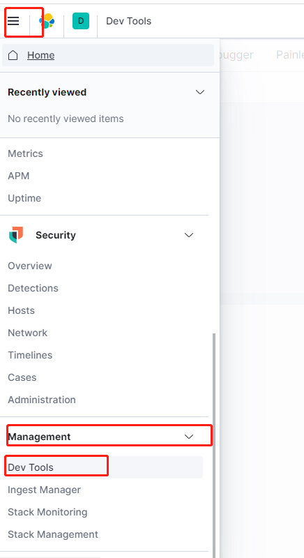
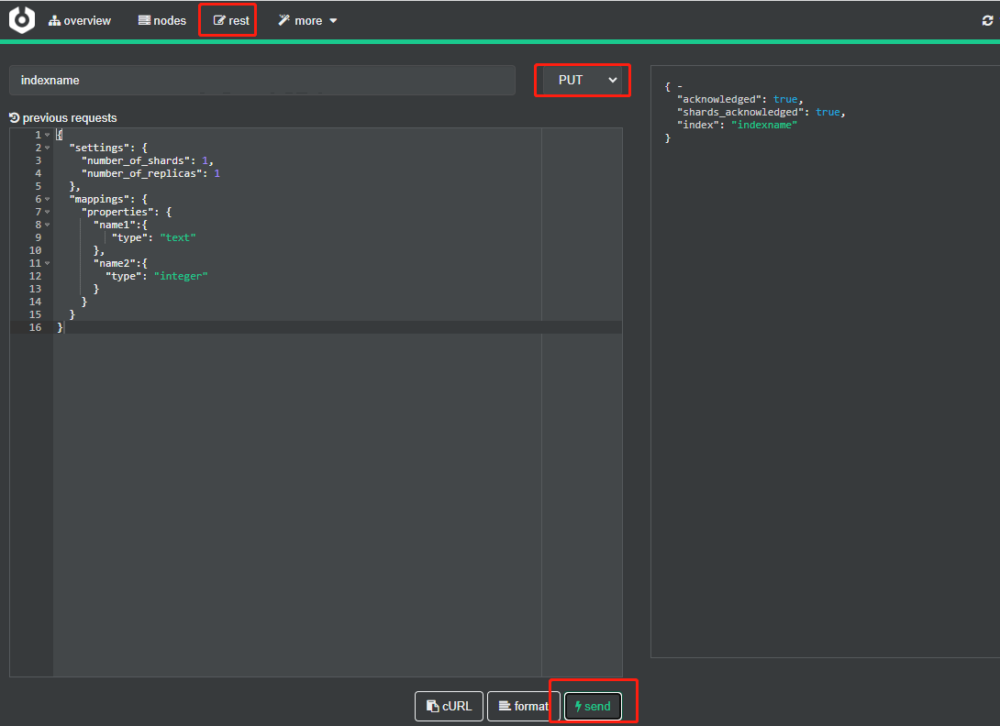
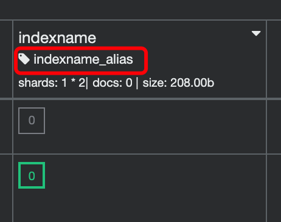
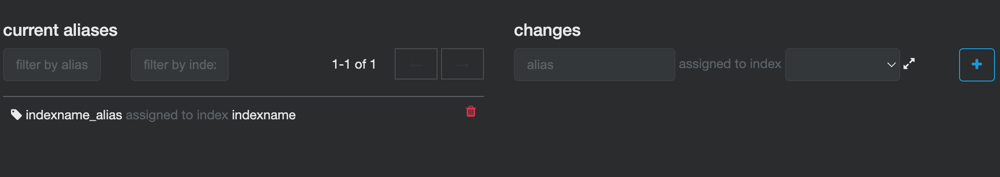

# 2.1 索引操作

ES索引是存储数据的容器，类似于数据库。

## 2.1.1 创建索引

### 1. DSL语法

```json
PUT /indexname
{
  "settings": {
    "number_of_shards": 1,
    "number_of_replicas": 1
  },
  "mappings": {
    "properties": {
      "name1":{
         "type": "text"
      },
      "name2":{
        "type": "integer"
      }
    }
  }
}
```
#### 1. 参数说明：

**settings：索引信息设置**
> number_of_shards：每个索引的主分片数，这个配置在索引创建后不能修改
>
> number_of_replicas：每个主分片的副本数，这个配置可以随时修改。

- 什么是分片？

> Elasticsearch集群允许系统存储的数据量超过单机容量，这是通过shard实现的。在一个索引index中，数据（document）被分片处理（sharding）到多个分片上。也就是说：每个分片都保存了全部数据中的一部分。
一个分片是一个 Lucene 的实例，它本身就是一个完整的搜索引擎。文档被存储到分片内，但应用程序直接与索引而不是与分片进行交互。

- 什么是副本？
> 为了解决访问压力过大时单机无法处理所有请求的问题，Elasticsearch集群引入了副本策略replica。副本策略对index中的每个分片创建冗余的副本。

- 副本的作用如下：

> 1. 提高系统容错性  
> 当分片所在的机器宕机时，Elasticsearch可以使用其副本进行恢复，从而避免数据丢失。
> 
> 2. 提高ES查询效率  
> 处理查询时，ES会把副本分片和主分片公平对待，将查询请求负载均衡到副本分片和主分片。
>

**mappings：索引映射定义**
> properties：字段定义
> properties里是json配置，key为字段名称（自定义名称），value是个嵌套json，`type`是指定字段的类型。

#### 2. 语句运行：

* 语句可以直接复制在kibana中执行，选择 `home` 下拉选择 `Management` 下的 `Dev Tools` 进行操作（Kibana只做简单介绍）



* 在cerebro中操作，选择 `rest` 编辑DSL语句，点击 `send` 请求（要操作的地方已经标红）



右侧是创建成功结果
```json
{ - 
  "acknowledged": true,
  "shards_acknowledged": true,
  "index": "indexname"
}
```

cerebro创建索引其他方式：选择 `more` 里面有很多配置， 点击 `create index` 也可以创建索引

### 2. Java API
在第一章已经介绍过一些创建索引的代码了

```java
    //从Spring容器获取client对象
    @Autowired
    private RestHighLevelClient client;

    public Boolean createIndex(String indexName) {
        //创建索引请求类，构造函数参数为索引名称
        CreateIndexRequest request = new CreateIndexRequest(indexName);
        //设置source映射字符串，直接把语句复制里面
        request.source(
                "{\n" +
                        "  \"settings\": {\n" +
                        "    \"number_of_shards\": 1,\n" +
                        "    \"number_of_replicas\": 1\n" +
                        "  },\n" +
                        "  \"mappings\": {\n" +
                        "    \"properties\": {\n" +
                        "      \"name1\":{\n" +
                        "         \"type\": \"text\"\n" +
                        "      },\n" +
                        "      \"name2\":{\n" +
                        "        \"type\": \"integer\"\n" +
                        "      }\n" +
                        "    }\n" +
                        "  }\n" +
                        "}",
                XContentType.JSON);
        try {
            //调用创建索引语法
            client.indices().create(request, RequestOptions.DEFAULT);
            return true;
        } catch (IOException e) {
            e.printStackTrace();
        }
        return false;
    }
```

<font color="red">注意这里调用的方法是source，不是mapping</font>
> mapping方法是仅设置字段
>
> source方法是带上settings内容一块调用的

## 2.1.2 删除索引

### 1. DSL语法
```json
DELETE /indexname
```
调用执行，以下返回结果为成功
```json
{ - 
  "acknowledged": true
}
```
### 2. Java API

```java
    //从Spring容器获取client对象
    @Autowired
    private RestHighLevelClient client;

    @RequestMapping("/deleteIndex")
    public Boolean deleteIndex(String indexName) {
        //删除索引请求类，构造函数参数为索引名称
        DeleteIndexRequest deleteIndexRequest = new DeleteIndexRequest(indexName);
        try {
            //调用删除索引语法
            client.indices().delete(deleteIndexRequest, RequestOptions.DEFAULT);
            return true;
        } catch (IOException e) {
            e.printStackTrace();
        }
        return false;
    }
```


## 2.1.3 开启/关闭索引

什么是 Elasticsearch 打开/关闭索引？
> 一旦索引被关闭，那么这个索引只能显示元数据信息，不能够进行读写操作。
> 再说说打开索引就好理解了。就是打开被关闭的索引，允许进行读写操作。


### 1. 关闭索引

#### 1. DSL语法
```json
POST /indexname/_close
```
调用执行，以下返回结果为成功
```json
{ - 
  "acknowledged": true,
  "shards_acknowledged": true,
  "indices": { - 
    "indexname": { - 
      "closed": true
    }
  }
}
```
#### 2. Java API

```java
    @RequestMapping("/closeIndex")
    public Boolean closeIndex(String indexName) {
        CloseIndexRequest closeIndexRequest = new CloseIndexRequest(indexName);
        try {
            client.indices().close(closeIndexRequest, RequestOptions.DEFAULT);
        } catch (IOException e) {
            e.printStackTrace();
        }
        return true;
    }
```

### 2. 开启索引

#### 1. DSL语法
```json
POST /indexname/_open
```
调用执行，以下返回结果为成功
```json
{ - 
  "acknowledged": true,
  "shards_acknowledged": true
}
```
#### 2. Java API

```java
    @RequestMapping("/openIndex")
    public Boolean openIndex(String indexName) {
        OpenIndexRequest openIndexRequest = new OpenIndexRequest(indexName);
        try {
            client.indices().open(openIndexRequest, RequestOptions.DEFAULT);
        } catch (IOException e) {
            e.printStackTrace();
        }
        return true;
    }
```

## 2.1.4 索引别名
索引别名概述：
> 在ES中，索引别名（index aliases）就像一个快捷方式或软连接，可以指向一个或多个索引。
别名有什么用？
> 1. 给多个索引设置一个别名，可以使用这个别名同时查询多个索引的数据。
> 
> 2. 例如一个项目场景，每天要建立一个新的索引，程序要查询新的索引数据，程序必然要改变访问的索引名称，如果实现用户无感知切换，那么代码复杂度较高，很容易会对服务的使用者产生一定的影响，过程越复杂，BUG就越容易出现。  
> 那么有了别名后，可以一开始就给索引加上这个别名，程序只关注访问这个别名，建立新索引后，把别名切换到新索引，程序不用变更，但是后续访问到了新的索引，并且无需停止应用的运行。当然这只是一个场景，在项目开发中，别名还有很多的用途，在后续项目讲解中我们会更多的介绍索引。

字段也有别名，使用率不太高，这里不过多讲解

### 1. 添加别名
创建索引别名，将别名`indexname_alias`与索引`indexname`关联
#### 1. DSL语法
1. 请求方式1
```json
PUT indexname/_alias/indexname_alias
```
2. 请求方式2
```json
POST _aliases
{
  "actions": [
    {
      "add": {
        "index": "indexname",
        "alias": "indexname_alias"
      }
    }
  ]
}
```
#### 2. Java API语法
```java
    @Autowired
    private RestHighLevelClient client;

    @RequestMapping("/addAlias")
    public Boolean addAlias(String indexName, String aliasName) {
        IndicesAliasesRequest indicesAliasesRequest = new IndicesAliasesRequest();
        IndicesAliasesRequest.AliasActions aliasActions = new IndicesAliasesRequest.AliasActions(IndicesAliasesRequest.AliasActions.Type.ADD);
        aliasActions.index(indexName).alias(aliasName);
        indicesAliasesRequest.addAliasAction(aliasActions);
        try {
            client.indices().updateAliases(indicesAliasesRequest, RequestOptions.DEFAULT);
        } catch (IOException e) {
            e.printStackTrace();
        }
        return true;
    }
```
接口接收两个参数，indexName：索引名，aliasName：要增加的别名

打开地址调用接口  
[http://localhost:8080/addAlias?indexName=indexname&aliasName=indexname_alias](http://localhost:8080/addAlias?indexName=indexname&aliasName=indexname_alias)


### 2. 删除别名
删除索引别名：解除别名`indexname_alias`与索引`indexname`的关联
#### 1. DSL语法
1. 请求方式1
```json
DELETE indexname/_alias/indexname_alias
```
2. 请求方式2
```json
POST _aliases
{
  "actions": [
    {
      "remove": {
        "index": "indexname",
        "alias": "indexname_alias"
      }
    }
  ]
}
```
#### 2. Java API语法
```java
    @Autowired
    private RestHighLevelClient client;

    @RequestMapping("/removeAlias")
    public Boolean removeAlias(String indexName, String aliasName) {
        IndicesAliasesRequest indicesAliasesRequest = new IndicesAliasesRequest();
        IndicesAliasesRequest.AliasActions aliasActions = new IndicesAliasesRequest.AliasActions(IndicesAliasesRequest.AliasActions.Type.REMOVE);
        aliasActions.index(indexName).alias(aliasName);
        indicesAliasesRequest.addAliasAction(aliasActions);
        try {
            client.indices().updateAliases(indicesAliasesRequest, RequestOptions.DEFAULT);
        } catch (IOException e) {
            e.printStackTrace();
        }
        return true;
    }
```
和增加一样，接口接收两个参数，indexName：索引名，aliasName：要增加的别名

打开地址调用接口  
[http://localhost:8080/removeAlias?indexName=indexname&aliasName=indexname_alias](http://localhost:8080/removeAlias?indexName=indexname&aliasName=indexname_alias)


### 3. 切换别名
切换一个别名是在同一个API中执行添加、删除操作。这个操作是原子的，不用担心别名不指向索引的短时间。

请读者自行创建两个索引 `indexname1` 和 `indexname2`，为了防止没必要的出错，请先给`indexname2`加上别名。
#### 1. DSL语法
```json
POST _aliases
{
  "actions": [
    {
      "add": {
        "index": "indexname1",
        "alias": "indexname_alias"
      }
    },
    {
      "remove": {
        "index": "indexname2",
        "alias": "indexname_alias"
      }
    }
  ]
}
```
#### 2. Java API语法
```java
    @Autowired
    private RestHighLevelClient client;

    @RequestMapping("/removeAlias")
    public Boolean removeAlias(String indexName, String aliasName) {
        IndicesAliasesRequest indicesAliasesRequest = new IndicesAliasesRequest();
        IndicesAliasesRequest.AliasActions aliasActions = new IndicesAliasesRequest.AliasActions(IndicesAliasesRequest.AliasActions.Type.REMOVE);
        aliasActions.index(indexName).alias(aliasName);
        indicesAliasesRequest.addAliasAction(aliasActions);
        try {
            client.indices().updateAliases(indicesAliasesRequest, RequestOptions.DEFAULT);
        } catch (IOException e) {
            e.printStackTrace();
        }
        return true;
    }
```
打开地址调用接口  
[http://localhost:8080/changeAlias](http://localhost:8080/changeAlias)


### 4. 查看别名

确认别名是否存在的话，可以在cerebro平台直接查看



也可以在 `more` 里选择 `aliases` 看所有索引的别名情况，这里也可以修改，功能非常的全面



#### 1. DSL语法
1. 通过别名查询索引
```json
GET _alias/indexname_alias
```
根据返回结果所示，`indexname` 索引下有这个别名
```json
{ - 
  "indexname": { - 
    "aliases": { - 
      "indexname_alias": { - 

      }
    }
  }
}
```

2. 通过索引查询别名
```json
GET indexname/_alias
```
3. 查看别名是否存在索引中
```json
GET indexname/_alias/indexname_alias
```

#### 2. Java API语法
1. 通过别名查询索引
```java
    @Autowired
    private RestHighLevelClient client;

    @RequestMapping("/selectIndexByAlias")
    public Map selectIndexByAlias(String aliasName) {
        GetAliasesRequest getAliasesRequest = new GetAliasesRequest(aliasName);
        // 指定查看某一个索引的别名 不指定，则会搜索所有的别名
        getAliasesRequest.indices();
        try {
            GetAliasesResponse response = client.indices().getAlias(getAliasesRequest,RequestOptions.DEFAULT);
            Map<String, Set<AliasMetadata>> aliases;
            aliases = response.getAliases();
            return aliases;
        } catch (IOException e) {
            e.printStackTrace();
        }
        return null;
    }
```
打开地址调用接口，页面出现返回结果  
[http://localhost:8080/selectIndexByAlias?aliasName=indexname_alias](http://localhost:8080/selectIndexByAlias?aliasName=indexname_alias)

2. 通过索引查询别名
```java
    @Autowired
    private RestHighLevelClient client;

    @RequestMapping("/selectIndexByAlias")
    public Map selectIndexByAlias(String aliasName) {
        GetAliasesRequest getAliasesRequest = new GetAliasesRequest();
        // 指定查看某一个索引的别名 不指定，则会搜索所有的别名
        getAliasesRequest.indices(indexName);
        try {
            GetAliasesResponse response = client.indices().getAlias(getAliasesRequest,RequestOptions.DEFAULT);
            Map<String, Set<AliasMetadata>> aliases;
            aliases = response.getAliases();
            return aliases;
        } catch (IOException e) {
            e.printStackTrace();
        }
        return null;
    }
```
打开地址调用接口，页面出现返回结果  
[http://localhost:8080/selectAliasByIndex?aliasName=indexname1](http://localhost:8080/selectAliasByIndex?aliasName=indexname1)

3. 查看别名是否存在索引中
```java
    @Autowired
    private RestHighLevelClient client;

    @RequestMapping("/getAliasExist")
    public Boolean getAliasExist(String indexName,String aliasName) {
        GetAliasesRequest getAliasesRequest = new GetAliasesRequest(aliasName);
        // 指定查看某一个索引的别名 不指定，则会搜索所有的别名
        getAliasesRequest.indices(indexName);
        try {
            return client.indices().existsAlias(getAliasesRequest, RequestOptions.DEFAULT);
        } catch (IOException e) {
            e.printStackTrace();
        }
        return false;
    }
```
打开地址调用接口，页面出现返回结果  
[http://localhost:8080/getAliasExist?indexName=indexname&aliasName=indexname_alias](http://localhost:8080/getAliasExist?indexName=indexname&aliasName=indexname_alias)