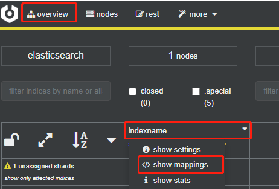

# 2.2 映射操作
学习了索引的创建，那么这一章开始讲映射，映射信息会有索引的字段信息。在本章我们会了解到映射的查询、创建和修改操作等。

## 2.2.1 查看映射

新建索引后，后续开发中会需要看下有哪些字段，那么我们可以在客户端工具查看，也可以用命令查看。
> 在cerebro中，选择 `overview` 找到要查看的索引，点击索引名，出现下拉框，选择 `show mappings` 就可以看到索引映射的字段信息了

如下图所示：



### 1. DSL语法
```json
GET indexname/_mapping
```
请求返回结果如下：
```json
{ - 
  "indexname": { - 
    "mappings": { - 
      "properties": { - 
        "name1": { - 
          "type": "text"
        },
        "name2": { - 
          "type": "integer"
        }
      }
    }
  }
}
```
返回的信息和建立该索引时的信息是一致的

### 2. Java API
```java
    @Autowired
    private RestHighLevelClient client;

    @RequestMapping("/getMapping")
    public Map getMapping(String indexName) throws IOException {
        GetMappingsRequest request = new GetMappingsRequest();
        request.indices(indexName);
        GetMappingsResponse mappingsResponse = client.indices().getMapping(request, RequestOptions.DEFAULT);
        Map<String, MappingMetadata> allMappings = mappingsResponse.mappings();
        MappingMetadata indexMapping = allMappings.get(indexName);
        Map<String, Object> mapping = indexMapping.sourceAsMap();
        return mapping;
    }
```
接口返回结果

## 2.2.2 新增映射
映射一般情况下是创建索引的时候就已经指定好的，但是在实际开发情况下，我们需要新增字段，那么就需要新增一个字段映射，<font color='red'>**需要注意的是字段映射只能增加，不能更改删除**</font>
### 1. DSL语法
```json
POST indexname/_mapping
{
  "properties":{
    "name3":{
      "type":"keyword"
    }
  }
}
```
新增字段 `name3` 类型设置 `keyword`

返回以下结果说明成功：
```json
{ - 
  "acknowledged": true
}
```
查询索引映射，返回结果如下：
```json
{ - 
  "indexname": { - 
    "mappings": { - 
      "properties": { - 
        "name1": { - 
          "type": "text"
        },
        "name2": { - 
          "type": "integer"
        },
        "name3": { - 
          "type": "keyword"
        }
      }
    }
  }
}
```
从返回结果可见，新字段映射已经添加成功。

### 2. Java API
```java
    @Autowired
    private RestHighLevelClient client;

    @RequestMapping("/addMapping")
    public Boolean addMapping(String indexName) {
        PutMappingRequest request = new PutMappingRequest(indexName);
        request.source(
                  "{\n" +
                        "  \"properties\":{\n" +
                        "    \"name3\":{\n" +
                        "      \"type\":\"keyword\"\n" +
                        "    }\n" +
                        "  }\n" +
                        "}", XContentType.JSON);
        try {
            client.indices().putMapping(request, RequestOptions.DEFAULT);
            return true;
        } catch (IOException e) {
            e.printStackTrace();
        }
        return false;
    }
```
调用接口后查看映射信息，会发现新增加了一个字段 `name3`