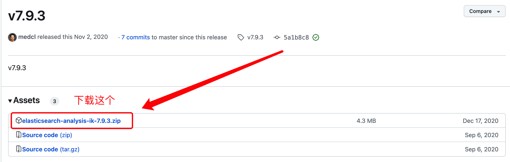

# 2.5 分词操作介绍

通过前面的学习，我们应该学会了基础的增删改查。但ES作为大名鼎鼎的搜索引擎，主要侧重于搜索，如果我们想要开发一个类似百度、谷歌这种搜索引擎，应该怎么做呢？我们搜索数据的时候，都是输入关键词去搜的，简单来说关键词会通过分词，去倒排索引匹配对应的文档返回结果。在本章节我们讲ES的分词搜索。

## 2.5.1 ES 分词器

### 1. 什么是分词

将文本切分为一系列单词的过程，比如 `我不吃牛肉` ，分词后结果为：`我、不吃、牛肉`

### 2. 分词器（Analyzer）介绍

分析器（Analyzer）也叫分词器

ES中执行分词的主体，官方把分词器分为三类

* Character Filters：针对文档的原始文本进行处理，过滤没有实际用途的字符、特殊符号等。
  ES 内置的 Character Filters：
  * HTML Strip Character Filter：支持剔除 html 标签，解码
  * Mapping Character Filter：支持根据定义的映射进行替换
  * Pattern Replace Character Filter：支持根据正则进行替换

* Tokenizer：将文档的原始文本按照规则切分为单词，分词的核心。
* Token Filters：对处理过Tokenizer后的单词进行二次加工，也就是分词的最后一步。

ES 内置的分析器有Standard Analyzer、Simple Analyzer、Whitespace Analyzer、Stop Analyzer、Keyword Analyzer、Pattern Analyzer、Language Analyzers、Fingerprint Analyzer，并且**支持定制化**。

三者的调用顺序：Character Filters -> Tokenizer -> Token Filters

#### 1. Analyzer介绍
这里简单介绍一下 Standard Analyzer、Keyword Analyzer，其他的分词器大家感兴趣可以自行查阅。

1. text 类型默认 analyzer：Standard Analyzer

Standard Analyzer 的组成部分：
TokenizerStandard Tokenizer：基于 Unicode 文本分割算法，支持使用 max_token_length 参数指定 token 长度，默认为 255。
Token Filters
Lower Case Token Filter
Stop Token Filter ：默认没有 stop token/words，需通过参数 stopwords 或 stopwords_path 进行指定。

如果 text 类型没有指定 Analyzer，Standard Analyzer，前面我们已经了解了 ES 分析器的结构，理解它的分析器应该不在话下。Unicode 文本分割算法依据的标准，给出了文本中词组、单词、句子的默认分割边界。像类似中文这种复杂的语言，并没有明确的分割边界，简而言之就是说，**中文并不适用于这个标准**。

通常我们的全文检索使用场景都是针对中文的，所以我们在创建我们的映射关系时，**一定要指定合适的分析器**。

2. keyword 类型默认 analyzer：Keyword Analyzer

Keyword Analyzer 本质上就是一个"noop" Analyzer，直接将输入的内容作为一整个 token。

#### 2. Analyzer API
ES提供了API语句来测试分词效果，以 `standard` 分词器示例

* 基础分词
```json
POST _analyze
{
  "analyzer": "standard",
  "text": "我不吃牛肉"
}
```
输出结果
```json
{
  "tokens" : [
    {
      "token" : "我",
      "start_offset" : 0,
      "end_offset" : 1,
      "type" : "<IDEOGRAPHIC>",
      "position" : 0
    },
    {
      "token" : "不",
      "start_offset" : 1,
      "end_offset" : 2,
      "type" : "<IDEOGRAPHIC>",
      "position" : 1
    },
    {
      "token" : "吃",
      "start_offset" : 2,
      "end_offset" : 3,
      "type" : "<IDEOGRAPHIC>",
      "position" : 2
    },
    {
      "token" : "牛",
      "start_offset" : 3,
      "end_offset" : 4,
      "type" : "<IDEOGRAPHIC>",
      "position" : 3
    },
    {
      "token" : "肉",
      "start_offset" : 4,
      "end_offset" : 5,
      "type" : "<IDEOGRAPHIC>",
      "position" : 4
    }
  ]
}
```
发现句子按照单个字切分了，ES中文默认就是按字切分，英文单词按照空格。后续讲解中文按词切分。

* 英文大写转小写切词
```json
POST _analyze
{
  "tokenizer": "standard",
  "filter": [
    "lowercase"
  ],
  "text": "Hello World"
}
```
输出结果
```json
{
  "tokens" : [
    {
      "token" : "hello",
      "start_offset" : 0,
      "end_offset" : 5,
      "type" : "<ALPHANUM>",
      "position" : 0
    },
    {
      "token" : "world",
      "start_offset" : 6,
      "end_offset" : 11,
      "type" : "<ALPHANUM>",
      "position" : 1
    }
  ]
}
```
与之前不同的是，它会将切分的词进行小写处理。这是因为我添加了一个lowercase的token filter，它会将分词的词进行小写处理。


## 2.5.2 第三方中文分词器

### 1. 中文分词介绍

ES自带的分词器仅支持英文，为什么呢？因为这是老外开发的，作者在此很期待读者未来发明国产的搜索引擎，默认支持中文！！！

不扯了，言归正传，如果要中文分词，那就需要安装第三方的分词插件，插件有很多，例如：比较出名的Ik、以及自然语言处理Hanlp。

中文分词和上面的英文分词不一样，英文文档中每个词都会按照空格分开，你只需要按照空格分词就行了。但是中文限制很多，受限于语境，受限于词性。

分词难点有很多，此处简单举例几个问题：

* **边界歧义**

与分词任务类似，Tagging任务也存在边界划分上的歧义，即不同的词划分方式可能有着不同的打标结果。如：
> 举例：南京市长江大桥
> 
> 结果1：南京市: 地名；长江大桥：地名
> 
> 结果2：南京市长：普通词；江大桥：人名

* **语义歧义**

同一个词在不同的上下文下有不同的语义，因此也通常有不同的打标结果：

> 举例：对于 "苹果" 的打标
> 
> 打标结果1：苹果手机 -> 苹果：品牌；手机：品类
> 
> 打标结果2：品尝苹果 -> 品尝：普通词；苹果：水果

* **嵌套歧义**

一个标签词或短语中可能包含另一个合理的打标结果：

> 举例：南京大学
> 
> 打标结果1：南京：地名；大学
> 
> 打标结果2：南京大学：机构名


本书不钻牛角尖，**本书重点是ES教程**，想学好搜索，就需要了解一下自然语言。在中文分词器中：**Ik分词没有根据句子的含义来分词，Hanlp能根据语义正确的切分出词**。Hanlp就是自然语言处理，大家可以先自行了解下，如果有需要作者写相关教程，可以向作者反馈（数量多的话可以写一份文档）。


### 2. IK分词器

官方Github地址：[https://github.com/medcl/elasticsearch-analysis-ik](https://github.com/medcl/elasticsearch-analysis-ik)

#### 1. IK Analyzer介绍：

IK Analyzer 是一个开源的，基于 java 语言开发的轻量级的中文分词工具包。从 2006 年 12 月推出 1.0 版开始， IKAnalyzer 已经推出了 4 个大版本。最初，它是以开源项目 Luence 为应用主体的，结合词典分词和文法分析算法的中文分词组件。从 3.0 版本开始，IK 发展为面向 Java 的公用分词组件，独立于 Lucene 项目，同时提供了对 Lucene 的默认优化实现。在 2012 版本中，IK 实现了简单的分词歧义排除算法，标志着 IK 分词器从单纯的词典分词向模拟语义分词衍化。


#### 2. 安装IK分词器

* 1. 选择IK版本和ES版本对应：

[https://github.com/medcl/elasticsearch-analysis-ik/releases/tag/v7.9.3](https://github.com/medcl/elasticsearch-analysis-ik/releases/tag/v7.9.3) 看清楚下载包和版本


* 2. 把下载好的`ik`分词器解压缩到`plugins`里面，注意目录和解压后的内容


* 3. 重启ES

自行解决重启

* 4. 测试中文分词效果


IK中文分词器插件给我们提供了两个分析器

ik_max_word：会将文本做最细粒度的拆分
ik_smart：会做最粗粒度的拆分

我们用`ik_smart`示例
```json
POST _analyze
{
  "analyzer": "ik_smart",
  "text": "我不吃牛肉"
}
```
输出结果
```json
{
  "tokens" : [
    {
      "token" : "我",
      "start_offset" : 0,
      "end_offset" : 1,
      "type" : "CN_CHAR",
      "position" : 0
    },
    {
      "token" : "不吃",
      "start_offset" : 1,
      "end_offset" : 3,
      "type" : "CN_WORD",
      "position" : 1
    },
    {
      "token" : "牛肉",
      "start_offset" : 3,
      "end_offset" : 5,
      "type" : "CN_WORD",
      "position" : 2
    }
  ]
}
```
发现分词已经正常了，不再按字分词了。


#### 3. 扩展IK词库

* 1. 词库介绍

IK分词是根据现有的词库进行分词的，主要有以下词库，位于config目录下

> 1. main.dic 主词库,包含日常生活中常用的词
> 2. stopword.dic 停用词,当出现该词库中的文本内容时,将不会建立倒排索引
> 3. quantifier.dic 计量单位等
> 4. suffix.dic 后缀名、行政单位等
> 5. surname.dic 百家姓等
> 6. preposition.dic 语气词等

* 2. 扩展词配置

虽然词库有很多词，但是每年都会有新的词语出现，或者是词库本身不全的词。

> 例如：佛系、复盘、赋能、对标

测试分词：
```json
POST _analyze
{
  "analyzer": "ik_smart",
  "text": "佛系、复盘、赋能、对标"
}
```
输出结果
```json
{
  "tokens" : [
    {
      "token" : "佛",
      "start_offset" : 0,
      "end_offset" : 1,
      "type" : "CN_CHAR",
      "position" : 0
    },
    {
      "token" : "系",
      "start_offset" : 1,
      "end_offset" : 2,
      "type" : "CN_CHAR",
      "position" : 1
    },
    {
      "token" : "复",
      "start_offset" : 3,
      "end_offset" : 4,
      "type" : "CN_CHAR",
      "position" : 2
    },
    {
      "token" : "盘",
      "start_offset" : 4,
      "end_offset" : 5,
      "type" : "CN_CHAR",
      "position" : 3
    },
    {
      "token" : "赋",
      "start_offset" : 6,
      "end_offset" : 7,
      "type" : "CN_CHAR",
      "position" : 4
    },
    {
      "token" : "能",
      "start_offset" : 7,
      "end_offset" : 8,
      "type" : "CN_CHAR",
      "position" : 5
    },
    {
      "token" : "对",
      "start_offset" : 9,
      "end_offset" : 10,
      "type" : "CN_CHAR",
      "position" : 6
    },
    {
      "token" : "标",
      "start_offset" : 10,
      "end_offset" : 11,
      "type" : "CN_CHAR",
      "position" : 7
    }
  ]
}
```
这些词目前还没有收录进来，还是单字切分。

1. 修改配置文件

对于IK词库里没有的词，如果拓展ik分词器的词库，需要修改ik分词器目录中的config目录中的IkAnalzer.cfg.xml文件：

```xml
<?xml version="1.0" encoding="UTF-8"?>
<!DOCTYPE properties SYSTEM "http://java.sun.com/dtd/properties.dtd">
<properties>
	<comment>IK Analyzer 扩展配置</comment>
	<!--用户可以在这里配置自己的扩展字典 -->
	<entry key="ext_dict">test_extra.dic</entry>
	 <!--用户可以在这里配置自己的扩展停止词字典-->
	<entry key="ext_stopwords"></entry>
	<!--用户可以在这里配置远程扩展字典 -->
	<!-- <entry key="remote_ext_dict">words_location</entry> -->
	<!--用户可以在这里配置远程扩展停止词字典-->
	<!-- <entry key="remote_ext_stopwords">words_location</entry> -->
</properties>
```
2. 创建扩展字典

扩展字典配置 `test_extra.dic` 文件，在config下新建，写入：

> 佛系
> 复盘
> 赋能
> 对标

一行一个词

3. 重启ES验证

重新请求分词接口

```json
POST _analyze
{
  "analyzer": "ik_smart",
  "text": "佛系、复盘、赋能、对标"
}
```

输出结果

```json
{
  "tokens" : [
    {
      "token" : "佛系",
      "start_offset" : 0,
      "end_offset" : 2,
      "type" : "CN_WORD",
      "position" : 0
    },
    {
      "token" : "复盘",
      "start_offset" : 3,
      "end_offset" : 5,
      "type" : "CN_WORD",
      "position" : 1
    },
    {
      "token" : "赋能",
      "start_offset" : 6,
      "end_offset" : 8,
      "type" : "CN_WORD",
      "position" : 2
    },
    {
      "token" : "对标",
      "start_offset" : 9,
      "end_offset" : 11,
      "type" : "CN_WORD",
      "position" : 3
    }
  ]
}
```

我们发现新扩展的词已经可以切分了

4. 热更新词库

每次增加新词就要重启，生产环境肯定不能这样做，那就需要热更新词库了

有以下几种方法热更新

> 1. 写自定义接口，IK定时拉取数据初始化
> 2. 读取数据库，配置数据库连接读取字典

### 3. Hanlp分词器
这个先不写了，展开写的话内容太多了，以防本书跑题，后面再补充，想研究的话自行搜索资料，也可以联系作者，给你分享相关参考资料。

## 2.5.3 分词查询

分词器配置好了以后，我们要应用起来，文档中的每个字段都会建立倒排索引，所以你也可以在创建索引的mapping时指定每个字段的分词器。

### 1. 创建索引设置分词器
`productName` 字段设置 `ik_smart` 分词器

```json
PUT product_index
{
  "mappings": {
    "properties": {
      "productName":{
         "type": "text",
         "analyzer": "ik_smart"
      }
    }
  }
}
```

### 2. 添加数据
```json
PUT product_index/_doc/1
{
  "productName":"苹果手机黑色，1024G超大内存"
}
```
### 3. 关键词检索
```json
GET product_index/_search
{
  "query":{
    "match": {
      "productName": "苹果超大内存手机"
    }
  }
}
```
返回结果
```json
{
  "took" : 5,
  "timed_out" : false,
  "_shards" : {
    "total" : 1,
    "successful" : 1,
    "skipped" : 0,
    "failed" : 0
  },
  "hits" : {
    "total" : {
      "value" : 1,
      "relation" : "eq"
    },
    "max_score" : 1.2401118,
    "hits" : [
      {
        "_index" : "product_index",
        "_type" : "_doc",
        "_id" : "1",
        "_score" : 1.2401118,
        "_source" : {
          "productName" : "苹果手机黑色，1024G超大内存"
        }
      }
    ]
  }
}
```

与以往不同是之前用term查询，现在用match， `match` 是对搜索关键词**先进行分词，再匹配查询**。

后续我们会讲解更加详细查询语法。