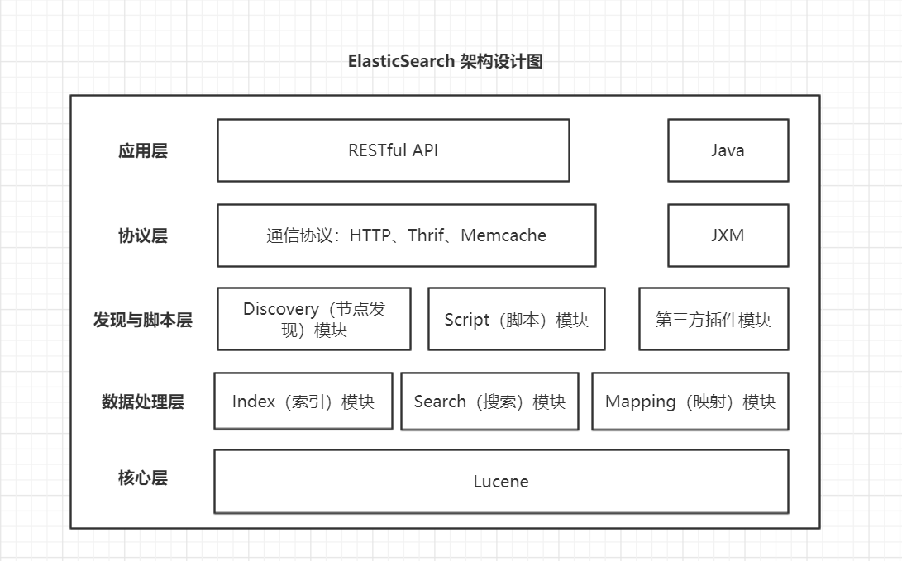

# 4.1 架构设计

## 4.1.1 核心概念

### 1. Node 节点

ES的节点分为两类，一类是Master，一类是DataNode。

#### 1. Master

在ES启动时，会选举出来一个Master。

1. 当节点启动的时候，会从配置列表找到其他节点，建立连接。
2. 并从候选主节点中选举出一个主节点。

* Master 负责内容：

管理索引（创建、删除）、分配分片  
维护元数据信息  
管理集群所有节点状态  
不负责数据处理

#### 2. DataNode

在ES集群中，可以有N多个DataNode节点。

* DataNode 负责内容：

数据操作（写入、数据检索）

压力都在DataNode节点上，配置最好大一些。

### 2. Cluster 集群

多个节点组合成的一个团队就是集群，由一个Master，多个DataNode组成。

### 3. Shards 分片
一个索引可以有多个分片，数据会分散存储到多个分片上，即一个分片包含一部分的数据，每一个分片都是一个 Lucene 的实例。创建索引时，分片数量一但确定，不可更改。

分片会分布在多个DataNode节点上面，分散请求压力。在集群扩大或缩小时，ES会自动迁移分片，使数据均匀分布在集群里。

### 4. Replicas 备份
为了防止节点宕机，导致分片数据缺失，从而衍生出来了 Replica ，分片的副本，也成为副分片。

每个分片可以创建N个副本，相当于主分片的替代品，保护数据不丢失的冗余备份。

### 5. Index 索引

数据存储的地方，数据会分布在多个分片里。

### 6. Type 类型

ES7后面只有一个type，`_doc`，旧版本不过多讲解。

### 7. Document 文档

具体的数据记录，序列化成JSON并存储到ElasticSearch中，指定了唯一ID

### 8. Field 字段

数据的字段

### 9. Id 主键

数据的唯一ID

## 4.1.2 分层设计

**说明：**
- Elasticsearch是基于Lucene架构实现的，所以其核心层为Lucene 
- Elasticsearch 目前支持HTTP、Thrift、Memcache三种协议，默认是HTTP 
- JMX指在Elasticsearch中对 Java 的管理架构，用来管理Elasticsearch应用
