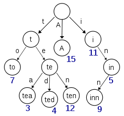
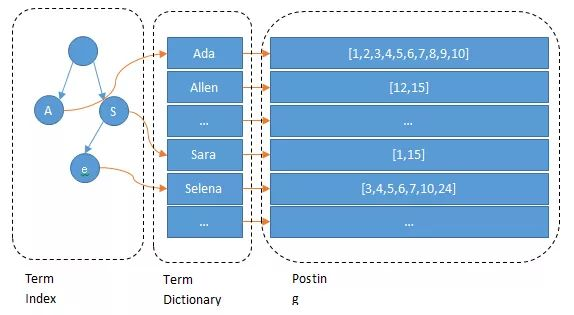

# 4.3 深入理解倒排索引
讲倒排索引之前我们先说一下正排索引。

以MySQL为例，在MySQL表中，每一行数据都有一个主键，查询数据会先找到ID，然后查整行数据，这种索引形式为正排索引，通过ID查value。而倒排索引恰好相反，是通过value查ID。

## 4.3.1 倒排索引基本原理
举例索引数据如下：
|文档ID|value
|---|----
|1|学习java
|2|学习golang 复习c
|3|复习java

对文档分词，得到以下倒排索引结构
|单词（term）|文档ID集合
|---|----
|学习|1,2
|复习|2,3
|java|1,3
|golang|2
|c|2

搜索 `java` 的时候，从倒排索引匹配 词=java，找到对应文档集合查询数据

- 倒排索引的term会对应1个或多个文档
- 倒排索引的term会按照词的从小到大排序

## 4.3.2 倒排索引结构
根据概念，我们可以用一个Map来简单描述这个结构，key是term，这部分组成了Dictionary，称为索引表。

另一个部分是 Postings List，称为记录表，对应上述的Map的value部分集合。

记录表是多个Postings组成，每个Postings包含以下信息：

- 文档 id（DocId, Document Id），包含term的所有文档唯一 id，用于去正排索引中查询原始数据。
- 词频（TF，Term Frequency），记录 Term 在每篇文档中出现的次数，用于后续相关性算分。
- 位置（Position），记录 Term 在每篇文档中的分词位置（多个），用于做词语搜索（Phrase Query）。
- 偏移（Offset），记录 Term 在每篇文档的开始和结束位置，用于高亮显示等。

## 4.3.3 倒排索引实现

全文检索在海量数据的情况下需要大量存储数据，所以会有以下问题：

- 索引表很大，搜索字段会有几千万个term
- 记录表会占据大量存储空间，一个term对应几百万个文档

因此使用Map存储是不靠谱的。

海量数据情况下，存储空间和检索性能带来了很大的问题，所以巧妙运用存储倒排索引的数据结构和算法，让倒排索引**节省空间、快读快写**

接下来会讲解索引表和记录表，分析倒排索引的实现。

### 1. 索引表（term dictionary）

ES在几千万个数据快速找到某个term，需要先把索引表数据排序，然后二分查找法去找term。

但是索引表数据量很大，不能一次性加载到内存中。也不能一个文件存储，所以分多个block方式存储，但多次读文件会损耗性能，至此衍生出来了term index。

### 2. term index

ES使用 `Burst-Trie` 结构来实现term index，这是 `字典树` 的一种变种，它主要是将后缀进行了压缩，降低了Trie的高度，从而获取更好查询性能。

没有了解过字典树的读者，可以参考图浅了解：

term index全部在缓存中，查找时，先快速定位到索引表大致位置，然后读取磁盘文件查找对应term，减少磁盘读取，由此来提高性能。

1. term index 在内存中是以 FST（finite state transducers）的形式保存的，其特点是非常节省内存。
2. term dictionary 的block内部利用公共前缀压缩，比如都是 Ab 开头的单词就可以把 Ab 省去，这样省空间。

### 3. Postings

PostingList 包含文档 id、词频、位置等多个信息，这些数据之间本身是相对独立的，因此 Lucene 将 Postings List 被拆成三个文件存储：
- doc后缀文件：记录 Postings 的 docId 信息和 Term 的词频
- pay后缀文件：记录 Payload 信息和偏移量信息
- pos后缀文件：记录位置信息

基本所有的查询都会用 .doc 文件获取文档 id，且一般的查询仅需要用到 .doc 文件就足够了。

.doc 文件存储的是每个 Term 对应的文档 Id 和词频。每个 Term 都包含一对 TermFreqs 和 SkipData 结构。

TermFreqs 存放 docId 和词频信息，SkipData 为跳表信息，用于实现 TermFreqs 内部的快速跳转。

