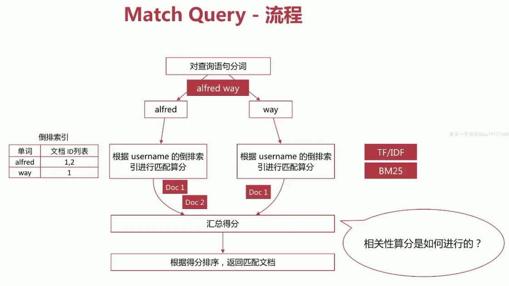
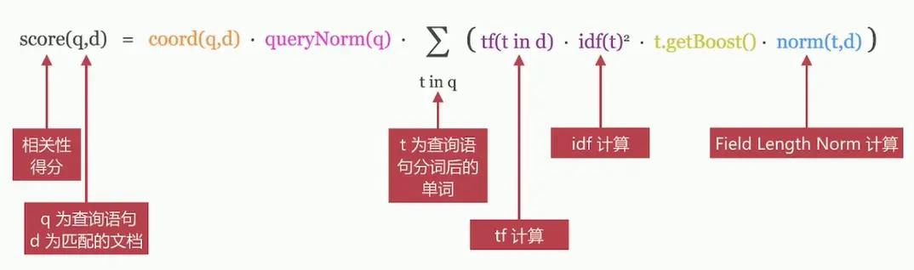
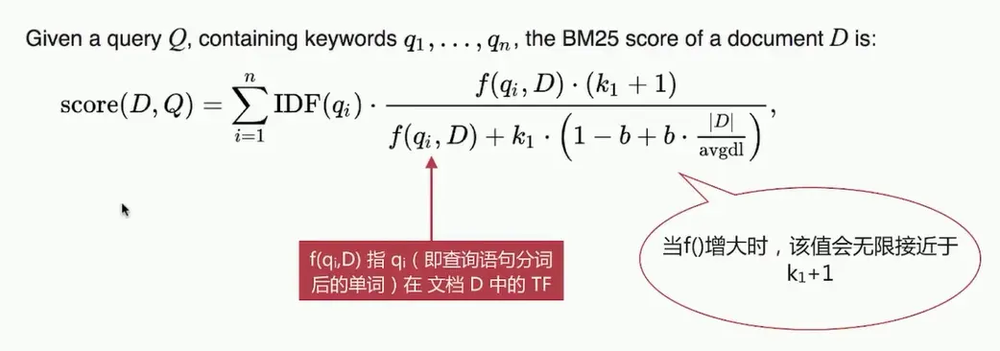

# 4.4 评分模型 TF/IDF算法

## 4.4.1 评分模型

ES是基于Lucene开发的，所以它的评分机制也是基于Lucene的。

ES最常用的评分模型是TF/IDF和BM25，TF/IDF是向量空间模型，BM25是概率模型，但是他们的差别不大，都是用IDF方法和TF方法的乘积来定义term的权重，然后把查询匹配的词项权重相加变成文档的分数。

ES 5.0版本之前的评分使用TF/IDF实现，在5.0版本之后默认使用BM25实现。

## 4.4.2 TF/IDF模型
相关性算分的几个重要概念如下：
1. Term Frequency(TF)词频：即单词在该文档中出现的次数，词频越高，相关度越高。
2. Document Frequency(DF)文档频率：即单词出现的文档数。	
3. Inverse Document Frequency(IDF)逆向文档频率：与文档频率相反，简单理解为1/DF。即单词出现的文档数越少，相关度越高。
4. Field-length Norm：文档越短，相关性越高，field长度，field越长，相关度越弱

TF/IDF模型是Lucene的经典模型，其计算公式如下：

## 4.4.3 BM25模型

BM25 模型中BM指的Best Match，25指的是在BM25中的计算公式是第25次迭代优化，是针对TF/IDF的一个优化，其计算公式如下：

