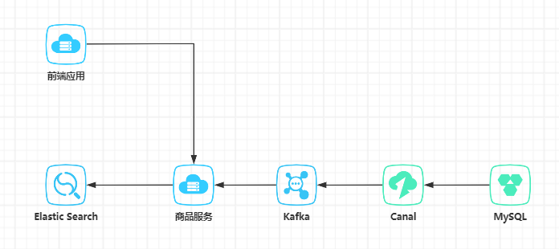

# 5.1 搜索引擎架构设计

项目使用SpringBoot搭建、数据库选用MySQL、MySQL数据同步ES使用canal+kafka

## 5.1.1 架构整体设计
项目流程图如下



数据存储使用MySQL，使用Canal监听binlog发送消息到kafka，商品服务监听kafka信息，写入ES中。  
前端应用操作数据调用商品服务。

## 5.1.2 MySQL表设计

1. 商品表结构
```sql
CREATE TABLE `sku_info`  (
  `id` int(11) NOT NULL AUTO_INCREMENT,
  `spu_id` int(11) NOT NULL DEFAULT 0 COMMENT 'spuId',
  `category_name` varchar(32) CHARACTER SET utf8mb4 COLLATE utf8mb4_general_ci NOT NULL DEFAULT '' COMMENT '类目',
  `product_name` varchar(64) CHARACTER SET utf8mb4 COLLATE utf8mb4_general_ci NOT NULL COMMENT '标题',
  `price` decimal(10, 2) NOT NULL DEFAULT 0.00 COMMENT '价格',
  `images` varchar(255) CHARACTER SET utf8mb4 COLLATE utf8mb4_general_ci NOT NULL DEFAULT '' COMMENT '图片',
  `attrs` varchar(255) CHARACTER SET utf8mb4 COLLATE utf8mb4_general_ci NOT NULL DEFAULT '' COMMENT '属性',
  `created_by` varchar(32) CHARACTER SET utf8mb4 COLLATE utf8mb4_general_ci NOT NULL DEFAULT 'system' COMMENT '创建人',
  `created_time` datetime NOT NULL DEFAULT CURRENT_TIMESTAMP COMMENT '创建时间',
  `updated_by` varchar(32) CHARACTER SET utf8mb4 COLLATE utf8mb4_general_ci NOT NULL DEFAULT 'system' COMMENT '更新人',
  `updated_time` timestamp NOT NULL DEFAULT CURRENT_TIMESTAMP ON UPDATE CURRENT_TIMESTAMP COMMENT '更新时间',
  `is_deleted` tinyint(2) NOT NULL DEFAULT 0 COMMENT '是否删除',
  PRIMARY KEY (`id`) USING BTREE
) ENGINE = InnoDB AUTO_INCREMENT = 1 CHARACTER SET = utf8mb4 COLLATE = utf8mb4_general_ci COMMENT = '商品表' ROW_FORMAT = Dynamic;
```

2. 初始化数据

```sql
INSERT INTO `sku_info` VALUES (1, 1, '手机', '新款现货Apple/苹果 iPhone 14 Pro国行苹果14promax双卡正品手机', 6349.00, '', '[{\"name\":\"颜色\",\"value\":\"黑色\"},{\"name\":\"内存\",\"value\":\"64G\"}]', 'system', '2023-11-14 09:42:57', 'system', '2023-11-14 17:11:58', 0);
INSERT INTO `sku_info` VALUES (2, 1, '手机', '新款现货Apple/苹果 iPhone 14 Pro国行苹果14promax双卡正品手机', 6349.00, '', '[{\"name\":\"颜色\",\"value\":\"白色\"},{\"name\":\"内存\",\"value\":\"64G\"}]', 'system', '2023-11-14 16:16:10', 'system', '2023-11-14 17:12:00', 0);
INSERT INTO `sku_info` VALUES (3, 1, '手机', '新款现货Apple/苹果 iPhone 14 Pro国行苹果14promax双卡正品手机', 6851.00, '', '[{\"name\":\"颜色\",\"value\":\"白色\"},{\"name\":\"内存\",\"value\":\"128G\"}]', 'system', '2023-11-14 16:16:23', 'system', '2023-11-14 17:12:00', 0);
INSERT INTO `sku_info` VALUES (4, 2, '手机', 'Apple/苹果 iPhone 12手机国行全网通双卡5G正品苹果12现货发顺丰', 2150.00, ' ', '[{\"name\":\"颜色\",\"value\":\"白色\"},{\"name\":\"内存\",\"value\":\"64G\"}]', 'system', '2023-11-14 16:30:16', 'system', '2023-11-14 17:12:00', 0);
INSERT INTO `sku_info` VALUES (5, 2, '手机', 'Apple/苹果 iPhone 12手机国行全网通双卡5G正品苹果12现货发顺丰', 2790.00, '', '[{\"name\":\"颜色\",\"value\":\"白色\"},{\"name\":\"内存\",\"value\":\"128G\"}]', 'system', '2023-11-14 16:33:05', 'system', '2023-11-14 17:12:00', 0);
INSERT INTO `sku_info` VALUES (6, 2, '手机', 'Apple/苹果 iPhone 12手机国行全网通双卡5G正品苹果12现货发顺丰', 2800.00, '', '[{\"name\":\"颜色\",\"value\":\"黑色\"},{\"name\":\"内存\",\"value\":\"128G\"}]', 'system', '2023-11-14 16:33:06', 'system', '2023-11-14 17:12:00', 0);
INSERT INTO `sku_info` VALUES (7, 3, '水果', '正宗新疆阿克苏冰糖心苹果10斤当季新鲜水果丑苹果时令红富士整箱', 49.00, '', '[{\"name\":\"重量\",\"value\":\"5kg\"}]', 'system', '2023-11-14 16:35:15', 'system', '2023-11-14 17:12:03', 0);
```

## 5.1.3 ES映射设计

使用IK分词器，配置同义词
```json
PUT product_index
{
  "settings": {
    "analysis": {
      "analyzer": {
        "my_ik_smart": {
          "tokenizer": "ik_smart",
          "filter": [
            "synonym"
          ]
        },
        "my_ik_max_word": {
          "tokenizer": "ik_max_word",
          "filter": [
            "synonym"
          ]
        }
      },
      "filter": {
        "synonym": {
          "type": "synonym",
          "synonyms_path": "analysis/synonym.txt"
        }
      }
    }
  },
  "mappings": {
    "properties": {
      "categoryName": {
        "type": "text",
        "analyzer": "my_ik_max_word",
        "search_analyzer": "my_ik_smart"
      },
      "productName": {
        "type": "text",
        "analyzer": "my_ik_max_word",
        "search_analyzer": "my_ik_smart"
      },
      "price": {
        "type": "double"
      },
      "attrs":{
        "type": "nested",
        "properties": {
          "name": {
            "type": "keyword"
          },
          "value": {
            "type": "keyword"
          }
        }
      }
    }
  }
}
```
检索的存储使用`ik_max_word`模式，尽量细分。搜索时使用`ik_smart`模式