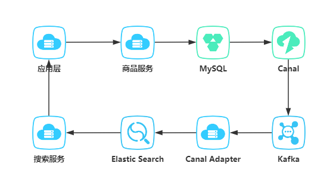

# 5.1 搜索引擎架构设计

项目使用SpringBoot搭建、数据库选用MySQL、MySQL数据同步ES使用canal+kafka

## 5.1.1 架构整体设计
项目流程图如下



数据存储使用MySQL，使用Canal监听binlog发送消息到kafka，商品服务监听kafka信息，写入ES中。  
前端应用操作数据调用商品服务。

## 5.1.2 MySQL表设计

1. 商品表结构
```sql
CREATE TABLE `product_info`  (
  `id` int(11) NOT NULL AUTO_INCREMENT,
  `product_name` varchar(64) CHARACTER SET utf8mb4 COLLATE utf8mb4_general_ci NOT NULL COMMENT '标题',
  `price` decimal(10, 2) NOT NULL DEFAULT 0.00 COMMENT '价格',
  `images` varchar(255) CHARACTER SET utf8mb4 COLLATE utf8mb4_general_ci NOT NULL COMMENT '图片',
  `attrs` varchar(255) CHARACTER SET utf8mb4 COLLATE utf8mb4_general_ci NOT NULL COMMENT '商品属性',
  `created_by` varchar(32) CHARACTER SET utf8mb4 COLLATE utf8mb4_general_ci NOT NULL DEFAULT 'system' COMMENT '创建人',
  `created_time` datetime NOT NULL DEFAULT CURRENT_TIMESTAMP COMMENT '创建时间',
  `updated_by` varchar(32) CHARACTER SET utf8mb4 COLLATE utf8mb4_general_ci NOT NULL DEFAULT 'system' COMMENT '更新人',
  `updated_time` timestamp NOT NULL DEFAULT CURRENT_TIMESTAMP ON UPDATE CURRENT_TIMESTAMP COMMENT '更新时间',
  `is_deleted` tinyint(2) NOT NULL DEFAULT 0 COMMENT '是否删除',
  PRIMARY KEY (`id`) USING BTREE
) ENGINE = InnoDB AUTO_INCREMENT = 1 CHARACTER SET = utf8mb4 COLLATE = utf8mb4_general_ci COMMENT = '商品表' ROW_FORMAT = Dynamic;
```

2. 初始化数据

```sql

```